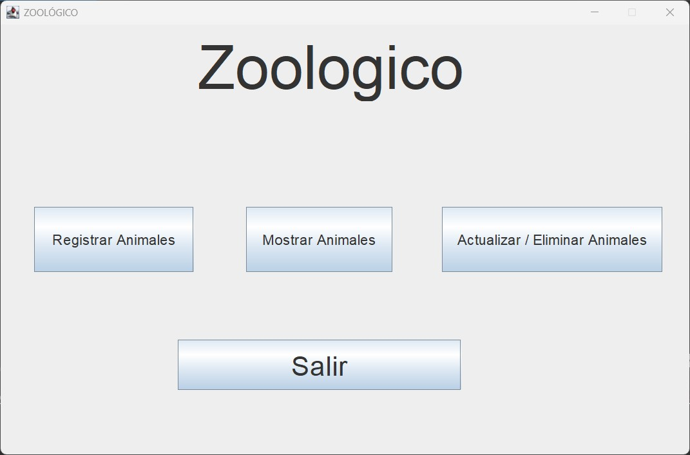
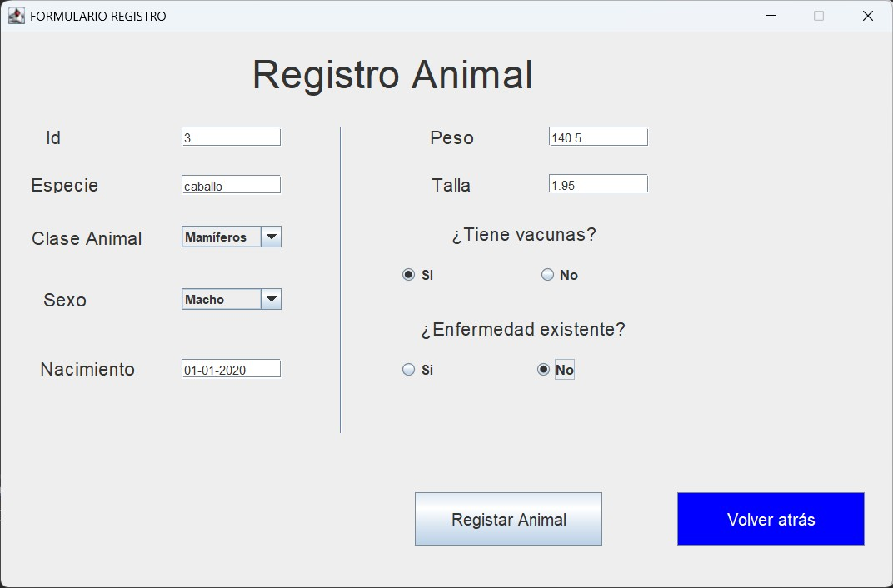
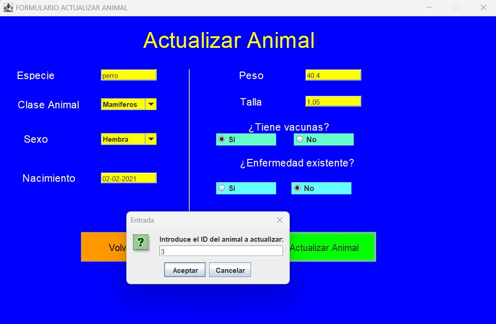
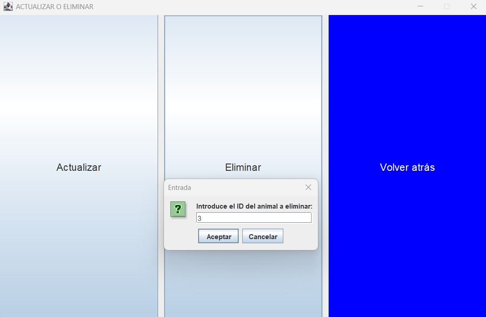

# 🐾 Proyecto Zoológico (Java + Swing)


Pequeña aplicación CRUD simple desarrollada en **Java** con interfaz gráfica **Swing** y base de datos persistente **MySQL**, diseñada para gestionar animales en un zoológico.  
Proyecto educativo para practicar operaciones **Crear, Leer, Actualizar y Eliminar** en Java.

---

## 🖼️ Capturas de pantalla

### Menú principal


### Registrar animal


### Mostrar animales


### Actualizar animal


### Eliminar animal


---

## 🚀 Funcionalidades
- Registrar nuevos animales en la base de datos (Create)
- Visualizar animales por categoría (Read)
- Actualizar datos de un animal existente (Update)
- Eliminar animales por ID (Delete)
- Interfaz gráfica con Swing y ventanas específicas para cada operación
- Conexión a base de datos MySQL

---

## 📂 Estructura
- `src/clases` → Código fuente Java.
- `ZooDatabase` → Manejo de conexión y operaciones CRUD.
- `Animal` → Clase modelo.
- `ZooGUI*` → Interfaces gráficas Swing.
        src/clases/
        ├── Animal.java # Clase modelo para los animales
        ├── ZooDatabase.java # Singleton para conexión y métodos CRUD
        ├── ZooGUI.java # Menú principal
        ├── ZooGUI_Registro.java # Formulario de registro
        ├── ZooGUI_Mostrar.java # Mostrar animales por tipo
        ├── ZooGUI_Actualizar.java # Formulario de actualización
        └── ZooGUI_Act_eliminar.java # Menú de actualización/eliminación

---

## ⚙️ Requisitos
- Java 8 o superior  
- MySQL en ejecución local  
- Base de datos: `Zoologico`  
- Tabla: `animales` con los campos:
  ```sql
  CREATE TABLE animales (
    id VARCHAR(50) PRIMARY KEY,
    nombre VARCHAR(100),
    especie VARCHAR(100),
    sexo VARCHAR(10),
    fecha_nacimiento DATE,
    peso DOUBLE,
    talla DOUBLE,
    vacunas BOOLEAN,
    enfermedades BOOLEAN
  );

---

## ▶️ Ejecución
Compila y ejecuta desde Eclipse o consola:
```bash
javac -d bin src/clases/*.java
java -cp bin clases.ZooGUI 
```

O importar el proyecto en Eclipse y ejecutar ZooGUI.java.

---

## 📖 Licencia

Este proyecto está bajo la licencia MIT – ver el archivo LICENSE
 para más detalles.

## 👤 Autor
José Ojeda López
